# Eneru — Fashion E-Commerce

Full-stack fashion store built with ASP.NET Core MVC. Browse products, manage a cart, place orders, and control everything from an admin panel.

---

## Tech Stack

| Layer | Technology |
|-------|------------|
| Framework | ASP.NET Core 8 MVC |
| Language | C# 12 |
| Database | SQLite |
| ORM | Entity Framework Core 8 |
| Frontend | Razor Views + Bootstrap 5 |
| Fonts | Cormorant Garamond + Inter (Google Fonts) |
| Auth | Custom session-based authentication |

---

## Features

**Shop**
- Product catalog with category filters (Tops, Bottoms, Shoes, Accessories)
- Search by product name or brand
- Product detail page with zoom lens on hover (Canvas API)
- Shopping cart with quantity controls and free shipping progress bar
- Checkout and order placement
- Order history with status tracking

**Account**
- Register and login with hashed passwords (SHA-256)
- Session-based authentication
- Cart count persists across pages

**Admin** — login with `admin@eneru.com` / `admin123`
- Dashboard with product, order and user counts
- Full product CRUD (create, edit, delete, show/hide)
- Image upload from disk or URL
- Order list with status management (Pending → Processing → Shipped → Delivered)

---

## Accounts

| Role | Email | Password |
|------|-------|----------|
| Admin | admin@eneru.com | admin123 |
| User | register at /Account/Register | your choice |

---

## Getting Started

### Prerequisites
- [.NET 8 SDK](https://dotnet.microsoft.com/download)
- Visual Studio 2022

### Run locally

```bash
git clone https://github.com/enelthegod/Eneru.git
cd Eneru/Eneru
dotnet ef database update
dotnet run
```

Open `https://localhost:7211`

---

## Project Structure

Eneru/
├── Controllers/
│   ├── HomeController.cs        — home page
│   ├── ProductsController.cs    — catalog and product detail
│   ├── CartController.cs        — cart management
│   ├── OrdersController.cs      — checkout and order history
│   ├── AccountController.cs     — register, login, logout
│   └── AdminController.cs       — admin panel
├── Models/
│   ├── Product.cs
│   ├── Category.cs
│   ├── User.cs
│   ├── Order.cs / OrderItem.cs
│   └── CartItem.cs
├── Views/
│   ├── Home / Products / Cart / Orders / Account / Admin
│   └── Shared/_Layout.cshtml    — navbar, footer, global styles
├── Data/
│   └── AppDbContext.cs          — EF Core context + seed data
├── Services/
│   ├── PasswordHasher.cs        — SHA-256 hashing
│   ├── AdminGuard.cs            — static admin check
│   └── ImageUploadService.cs    — file upload to wwwroot/uploads
└── wwwroot/
└── uploads/                 — uploaded product images
---

# Screenshots

##  Home

<p align="center">
  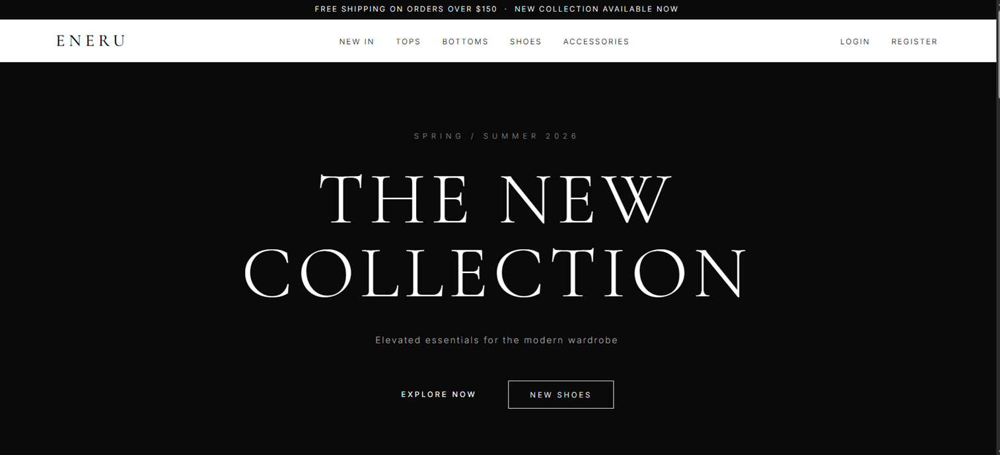
</p>

<p align="center">
  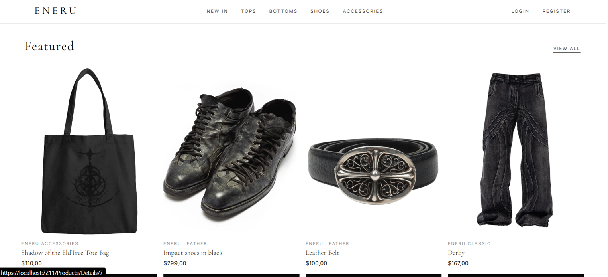
</p>

<p align="center">
  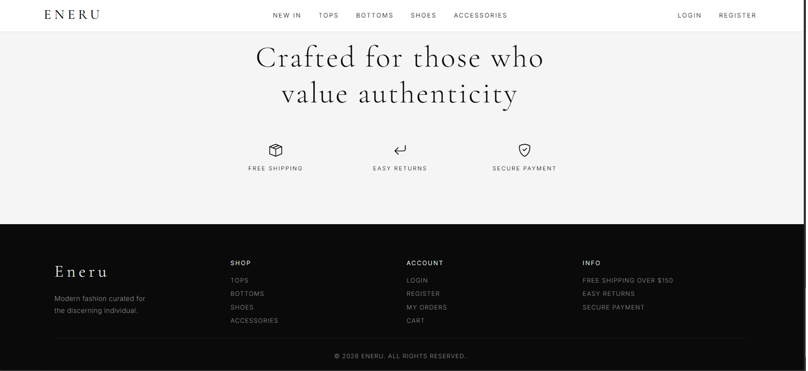
</p>

---

##  Login

<p align="center">
  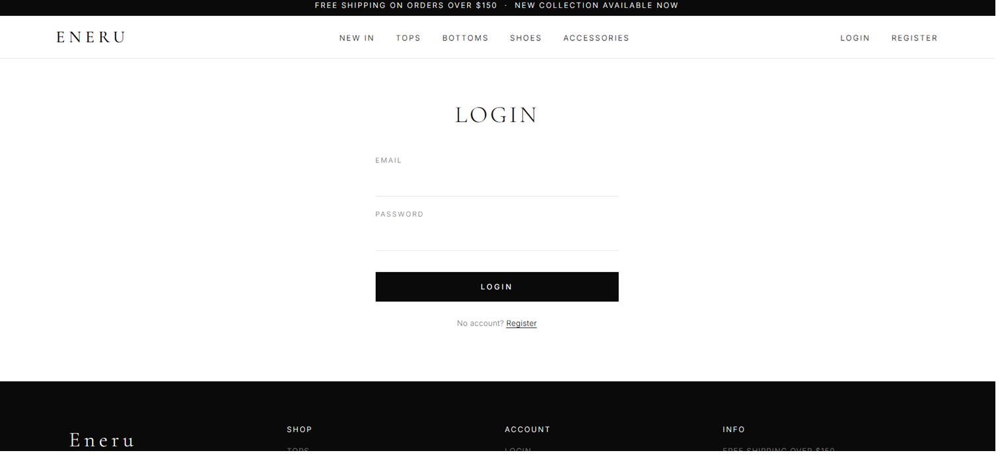
</p>

---

##  Register

<p align="center">
  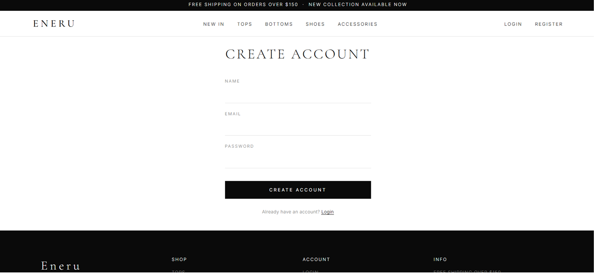
</p>

---

##  Admin Panel

<p align="center">
  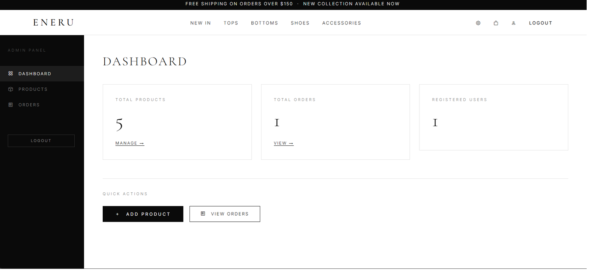
</p>

<p align="center">
  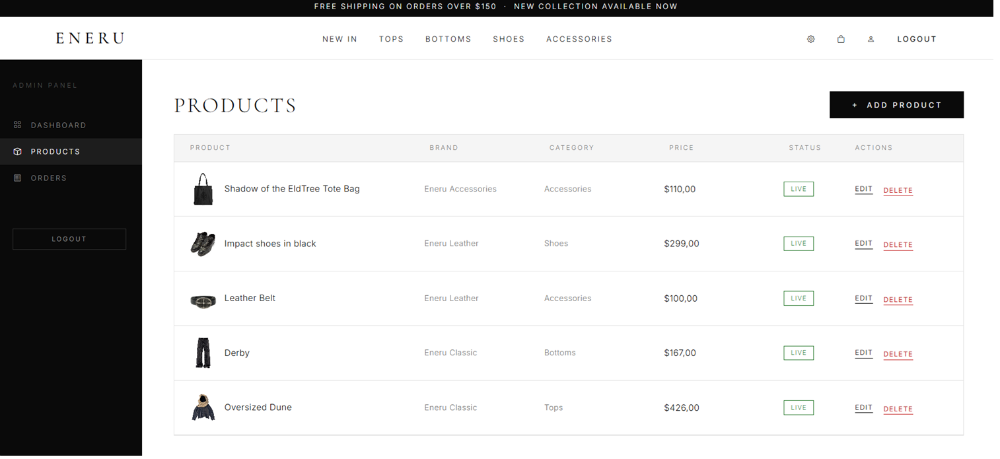
</p>

<p align="center">
  
</p>

<p align="center">
  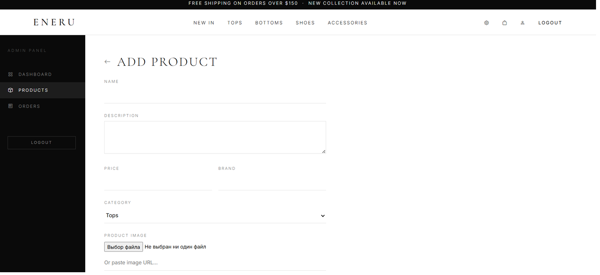
</p>

---

##  User Panel

<p align="center">
  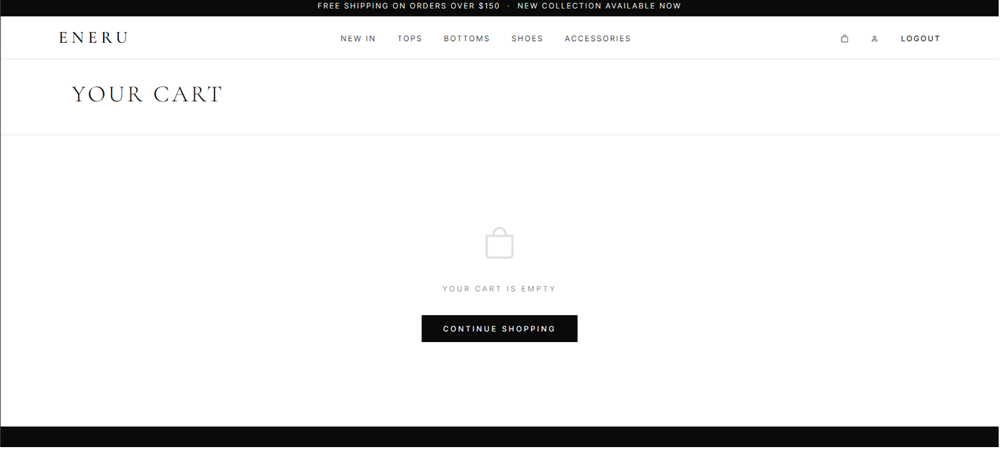
</p>

<p align="center">
  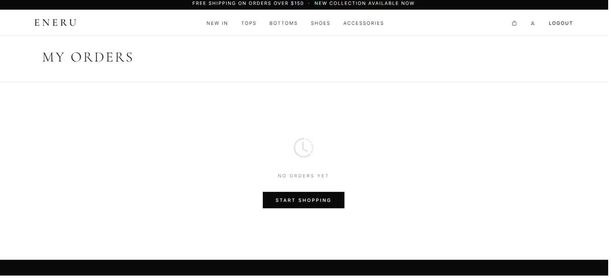
</p>

<p align="center">
  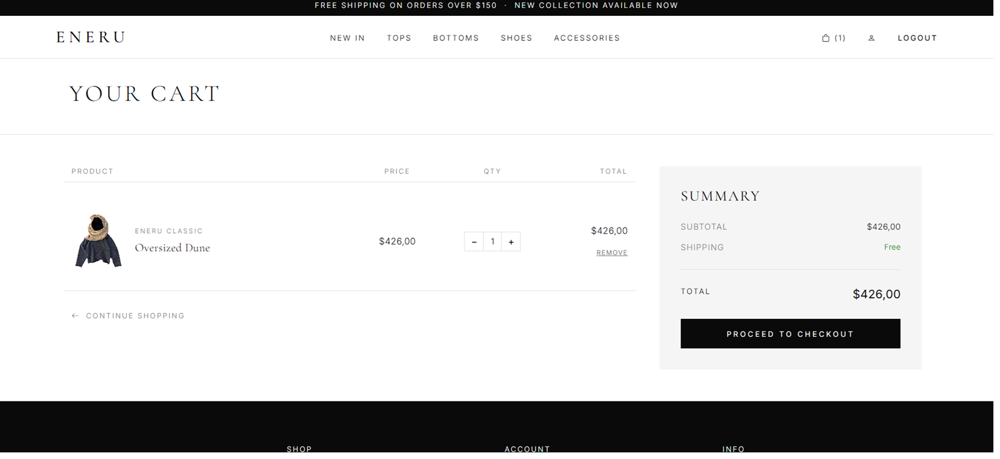
</p>

<p align="center">
  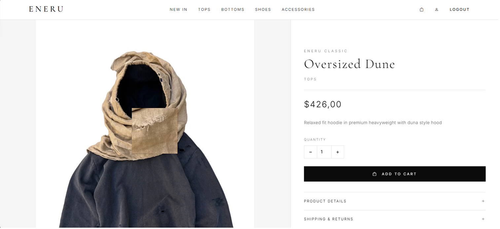
</p>